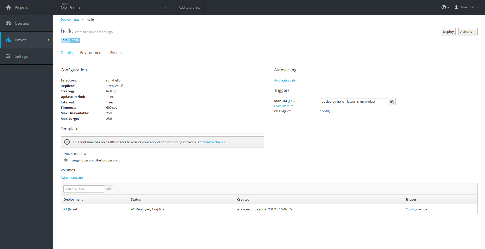

# Install OpenShift CLI

The simples and easiest option to get OpenShift is to visit our GitHub release
page at https://github.com/openshift/origin/releases/.


# Setting up cluster

With the upcoming OpenShift Origin v1.3 we're introducing `oc cluster up/down`
command, which allows easily setup the all-in-one container on a Docker host.

```
$ oc cluster up --public-hostname=10.2.2.2
-- Checking OpenShift client ... OK
-- Checking Docker client ... OK
-- Checking for existing OpenShift container ... OK
-- Checking for openshift/origin:v1.3.0-alpha.2 image ... OK
-- Checking Docker daemon configuration ... OK
-- Checking for available ports ... OK
-- Checking type of volume mount ...
   Using nsenter mounter for OpenShift volumes
-- Checking Docker version ... OK
-- Creating host directories ... OK
-- Finding server IP ...
   Using public hostname IP 10.2.2.2 as the host IP
   Using 10.2.2.2 as the server IP
-- Starting OpenShift container ...
   Creating initial OpenShift configuration
   Starting OpenShift using container 'origin'
   Waiting for API server to start listening
   OpenShift server started
-- Installing registry ... OK
-- Installing router ... OK
-- Importing image streams ... OK
-- Importing templates ... OK
-- Login to server ... OK
-- Creating initial project "myproject" ... OK
-- Server Information ...
   OpenShift server started.
   The server is accessible via web console at:
       https://10.2.2.2:8443

   You are logged in as:
       User:     developer
       Password: developer

   To login as administrator:
       oc login -u system:admin
```

To verify currently logged in user:

```
$ oc whoami
developer
```

### Troubleshooting

```
Error: did not detect an --insecure-registry argument on the Docker daemon
   Solution:

     Ensure that the Docker daemon is running with the following argument:
        --insecure-registry 172.30.0.0/16
```


# Running a pod

```
$ oc run hello --image=openshift/hello-openshift --restart=Never
pod "hello" created
```

```
$ oc get pods
NAME      READY     STATUS    RESTARTS   AGE
hello     1/1       Running   0          2s
```

To view status of the current project, iow. what resources are running:

```
$ oc status
In project My Project (myproject) on server https://10.2.2.2:8443

pod/hello runs openshift/hello-openshift

You have no services, deployment configs, or build configs.
Run 'oc new-app' to create an application.
```

```
$ oc edit pod/hello
```

```
$ oc get pod/hello -o yaml
```


Current project's overview from the web interface:


### Troubleshooting

At any point in time you can remove *all* the resources in the project:

```
oc delete all --all
```


# Running a Deployment

```
$ oc run hello --image=openshift/hello-openshift
deploymentconfig "hello" created
```

```
$ oc status
In project My Project (myproject) on server https://10.2.2.2:8443

dc/hello deploys docker.io/openshift/hello-openshift:latest
  deployment #1 deployed 11 seconds ago - 1 pod

1 warning identified, use 'oc status -v' to see details.
```

```
$ oc status -v
In project My Project (myproject) on server https://10.2.2.2:8443

dc/hello deploys docker.io/openshift/hello-openshift:latest
  deployment #1 deployed 14 seconds ago - 1 pod

Warnings:
  * dc/hello has no readiness probe to verify pods are ready to accept traffic or ensure deployment is successful.
    try: oc set probe dc/hello --readiness ...

View details with 'oc describe <resource>/<name>' or list everything with 'oc get all'.
```

```
oc set probe dc/hello --readiness --get-url=http://:8080/
```

```
oc get
```

Deployment overview from the web UI:




# Building your application (from CLI)

```
$ oc get imagestream -n openshift
NAME         DOCKER REPO                                TAGS                         UPDATED
jenkins      172.30.243.152:5000/openshift/jenkins      1,latest                     7 minutes ago
mariadb      172.30.243.152:5000/openshift/mariadb      10.1,latest                  7 minutes ago
mongodb      172.30.243.152:5000/openshift/mongodb      2.4,2.6,3.2 + 1 more...      7 minutes ago
mysql        172.30.243.152:5000/openshift/mysql        5.5,5.6,latest               7 minutes ago
nodejs       172.30.243.152:5000/openshift/nodejs       0.10,4,latest                8 minutes ago
perl         172.30.243.152:5000/openshift/perl         5.16,5.20,latest             8 minutes ago
php          172.30.243.152:5000/openshift/php          5.5,5.6,latest               8 minutes ago
postgresql   172.30.243.152:5000/openshift/postgresql   9.4,9.5,latest + 1 more...   7 minutes ago
python       172.30.243.152:5000/openshift/python       2.7,3.3,3.4 + 2 more...      8 minutes ago
ruby         172.30.243.152:5000/openshift/ruby         2.2,2.3,latest + 1 more...   8 minutes ago
wildfly      172.30.243.152:5000/openshift/wildfly      10.0,8.1,9.0 + 1 more...     7 minutes ago
```

```
[vagrant@origin ~]$ oc new-app python:3.5~https://github.com/openshift/django-ex
--> Found image 6995879 (4 days old) in image stream "python" in project "openshift" under tag "3.5" for "python:3.5"

    Python 3.5
    ----------
    Platform for building and running Python 3.5 applications

    Tags: builder, python, python35, rh-python35

    * A source build using source code from https://github.com/openshift/django-ex will be created
      * The resulting image will be pushed to image stream "django-ex:latest"
      * Use 'start-build' to trigger a new build
    * This image will be deployed in deployment config "django-ex"
    * Port 8080/tcp will be load balanced by service "django-ex"
      * Other containers can access this service through the hostname "django-ex"

--> Creating resources with label app=django-ex ...
    imagestream "django-ex" created
    buildconfig "django-ex" created
    deploymentconfig "django-ex" created
    service "django-ex" created
--> Success
    Build scheduled, use 'oc logs -f bc/django-ex' to track its progress.
    Run 'oc status' to view your app.
```

```
$ oc status
In project My Project (myproject) on server https://10.2.2.2:8443

svc/django-ex - 172.30.109.61:8080
  dc/django-ex deploys istag/django-ex:latest <-
    bc/django-ex source builds https://github.com/openshift/django-ex on openshift/python:3.5
      build #1 running for less than a second
    deployment #1 waiting on image or update

1 warning identified, use 'oc status -v' to see details.
```

*NOTE* The same warning about missing rediness check.

```
oc set probe dc/hello --readiness --get-url=http://:8080/
```

```
$ oc get build
NAME          TYPE      FROM          STATUS     STARTED         DURATION
django-ex-1   Source    Git@fa3c4f3   Complete   4 minutes ago   1m34s
```

```
$ oc logs build/django-ex-1
...
Downloading "https://github.com/openshift/django-ex" ...
Cloning source from https://github.com/openshift/django-ex
---> Installing application source ...
---> Installing dependencies ...
...
Pushing image 172.30.243.152:5000/myproject/django-ex:latest ...
...
Push successful
```

```
$ oc get service
NAME        CLUSTER-IP      EXTERNAL-IP   PORT(S)    AGE
django-ex   172.30.109.61   <none>        8080/TCP   7m
```

```
$ oc expose service/django-ex
route "django-ex" exposed
```

```
$ oc get route
NAME        HOST/PORT                             PATH      SERVICE              TERMINATION   LABELS
django-ex   django-ex-myproject.10.2.2.2.xip.io             django-ex:8080-tcp                 app=django-ex
```


# Building your application from web UI:


# Links

https://github.com/openshift/origin/
https://github.com/openshift/source-to-image/
https://docs.openshift.org/latest/welcome/index.html
https://github.com/sclorg/s2i-nodejs-container
https://github.com/sclorg/s2i-perl-container
https://github.com/sclorg/s2i-php-container
https://github.com/sclorg/s2i-python-container
https://github.com/sclorg/s2i-ruby-container
https://blog.openshift.com/source-image-s2i-deep-dive-ben-parees-openshift-commons-briefing-43/
https://blog.openshift.com/create-s2i-builder-image/
