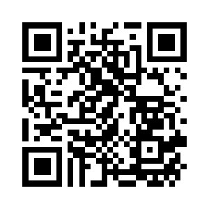

name: title
layout: true
class: center, middle, inverse
---
# Audit in Kubernetes
# now, and the future
<br />
## Maciej Szulik / @soltysh
### Red Hat / OpenShift

???
We are humans, and we do make mistakes.  At the same time we learn from our mistakes,
and from others mistakes.

Quote from Amazon recent S3 disruption (https://aws.amazon.com/message/41926/):
(...) an authorized S3 team member using an established playbook executed a command
which was intended to remove a small number of servers for one of the S3 subsystems
that is used by the S3 billing process. Unfortunately, one of the inputs to the
command was entered incorrectly and a larger set of servers was removed than intended.

The question we need to answer here is how will you know what and when happened
that caused your service disruption?  Yet, the answer is reasonable simple - audit.
We have audit in linux, what about kubernetes?  One cluster might be processing
millions of requests every hour how to find the one offending one in that volume
of data?


---
layout: false
.left-column[
<br />
.no-margin[
# Request flow
]]
.center[

]

???

Each request goes through several filters on its way to the actual REST handler.
These are:
- RequestContext - ensures there is a Context object associated with the request
- RequestInfo - attaches a RequestInfo to the context
- MaxInFlightLimit - limits the number of in-flight requests
- TimeoutForNonLongRunningRequests - times out non-long-running requests after the given global timeout
- PanicRecovery - wraps an http Handler to recover and log panics
- CORS - a simple CORS (cross-origin HTTP request) implementation
- Authentication - performs authentication
- Audit - the actual audit filter
- Impersonation - reads request that attempt to change user (--as)
- Authorization - performs authorization

Since k8s 1.7 audit also works for not protected endpoints.


---
.left-column[
# Demo
]
.right-column[
<br /><br /><br />
.big-code[
```bash
kube-apiserver
...
    --audit-log-maxage
    --audit-log-maxbackup
    --audit-log-maxsize
    --audit-log-path
```
]
.footnote[
https://kubernetes.io/docs/admin/kube-apiserver/
]]

???

- audit-log-maxage - maximum number of days to retain old audit log files based
  on the timestamp encoded in their filename
- audit-log-maxbackup - maximum number of old audit log files to retain
- audit-log-maxsize - maximum size in megabytes of the audit log file before it
  gets rotated. Defaults to 100MB.
- audit-log-path - all requests coming to the apiserver will be logged to this file


---
.left-column[

]
.right-column[
<br /><br /><br /><br /><br /><br /><br /><br /><br /><br />
### Audit trails maintain a record of (...) activity (...).
### (...) audit trails can assist in detecting security violations, performance problems, and flaws in applications.
.footnote[
http://csrc.nist.gov/publications/nistbul/itl97-03.txt
]]

???

Audit trails maintain a record of system activity both by system and
application processes and by user activity of systems and applications.  In
conjunction with appropriate tools and procedures, audit trails can assist
in detecting security violations, performance problems, and flaws in
applications.


---
.left-column[

]
.right-column[
## .strong[What] happened?
## .strong[When] did it happen?
## .strong[Who] initiated it?
## .strong[On what] did it happen?
## .strong[Where] it was observed?
## .strong[From where] it was initiated?
## .strong[To where] was it going?
]

???


---
.left-column[

]
.right-column[
## What happened?
.big-code[
```bash
method="GET"
```
]

## When did it happen?
.big-code[
```bash
2016-09-07T13:03:57.400333046Z
```
]

## Who initiated it?
.big-code[
```bash
user="admin"
groups="admins"
as="<self>"
asgroups="<lookup>"
```
]]

???


---
.left-column[

]
.right-column[
## On what did it happen?
.big-code[
```bash
namespace="default"
uri="/api/v1/namespaces/default/pods"

```
]

## From where was it initiated?
.big-code[
```bash
ip="127.0.0.1"
```
]
<br />
## Where it was observed?
## To where was it going?
]

???


---
name: title
layout: true
class: center, middle, inverse
---
# The Future
.pull-left[
## [features/issues/22](https://github.com/kubernetes/features/issues/22)
<br />

]
.pull-right[
## [community/pull/145](https://github.com/kubernetes/community/pull/145)
<br />

]

???

---
layout: false
.left-column[]
.right-column[]


---
name: title
layout: true
class: center, middle, inverse
---

<br /><br /><br />
## Maciej Szulik / @soltysh
### Red Hat / OpenShift

???

Kubernetes is community project and we need community support to design and implement
this feature.  Users/administrators/operators provide ideas about the feature shape.
Developers invest time into implementing this feature.

############

Ideas from reading about linux audit:
- Audit does not provide additional security to your system; rather, it can be
  used to discover violations of security policies used on your system

https://github.com/linux-audit/audit-documentation/wiki

1. What is auditing
  * Definition
  * The 7W's of auditing
1. Current audit state in Kubernetes
  * How it works
  * Live demo
1. Advanced Audit proposal
  * Use Cases
  * Proposed design
    * audit events - data gathered during request processing
    * audit policies - how detailed information will be gathered
    * audit output - where audit data will be stored
  * Constraints/Assumption

https://github.com/kubernetes/features/issues/22
https://github.com/kubernetes/community/pull/145
