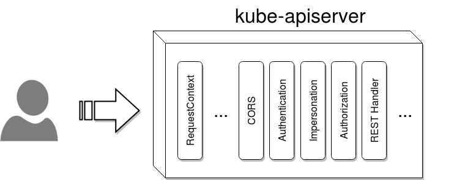

background-image: url(img/title.png)

???

We are humans, and we do make mistakes.  At the same time we learn from our mistakes,
and from others mistakes.

Quote from Amazon recent S3 disruption (https://aws.amazon.com/message/41926/):
(...) an authorized S3 team member using an established playbook executed a command
which was intended to remove a small number of servers for one of the S3 subsystems
that is used by the S3 billing process. Unfortunately, one of the inputs to the
command was entered incorrectly and a larger set of servers was removed than intended.

The question we need to answer here is how will you know what and when happened
that caused your service disruption?  Yet, the answer is reasonable simple - audit.
We have audit in linux, what about kubernetes?  One cluster might be processing
millions of requests every hour how to find the one offending one in that volume
of data?


---
.center[
.pull-left[
# Request flow
]

]

???

Let me tell you a story how audit came to live.

Each request goes through several filters on its way to the actual REST handler.
These are:
- RequestContext - ensures there is a Context object associated with the request
- RequestInfo - attaches a RequestInfo to the context
- MaxInFlightLimit - limits the number of in-flight requests
- TimeoutForNonLongRunningRequests - times out non-long-running requests after the given global timeout
- PanicRecovery - wraps an http Handler to recover and log panics
- CORS - a simple CORS (cross-origin HTTP request) implementation
- Authentication - performs authentication
- Impersonation - reads request that attempt to change user (--as)
- Authorization - performs authorization


---
.center[
.pull-left[
# Request flow
]

]

???

- Audit - the actual audit filter

Since k8s 1.6 audit also works for not protected endpoints.


---
.left-column[
# Demo
]
.right-column[
<br /><br /><br />
.big-code[
```bash
kube-apiserver
...
    --audit-log-maxage
    --audit-log-maxbackup
    --audit-log-maxsize
    --audit-log-path
```
]
.footnote[
https://kubernetes.io/docs/admin/kube-apiserver/
]]

???

- audit-log-maxage - maximum number of days to retain old audit log files based
  on the timestamp encoded in their filename
- audit-log-maxbackup - maximum number of old audit log files to retain
- audit-log-maxsize - maximum size in megabytes of the audit log file before it
  gets rotated. Defaults to 100MB.
- audit-log-path - all requests coming to the apiserver will be logged to this file


---
name: title
layout: true
class: center, middle, inverse
---
.center[
# Audit does not provide additional security to your system

]

???

Audit does not provide additional security to your system;
rather, it can be used to discover violations of security policies used on your system


---
layout: false
.left-column[

]
.right-column[
<br /><br /><br /><br /><br /><br /><br /><br /><br /><br />
### Audit trails maintain a record of (...) activity (...).
### (...) audit trails can assist in detecting security violations, performance problems, and flaws in applications.
.footnote[
http://csrc.nist.gov/publications/nistbul/itl97-03.txt
]]

???

Audit trails maintain a record of system activity both by system and
application processes and by user activity of systems and applications.  In
conjunction with appropriate tools and procedures, audit trails can assist
in detecting security violations, performance problems, and flaws in
applications.


---
.center[
<br /><br />
# Cloud Auditing Data Federation
### https://www.dmtf.org/standards/cadf
]

???

We didn't came up with the ideas of this proposal out of nowhere. We based our
work on existing solutions from Cloud Auditing Data Federation, which is used
by OpenStack, above all. CADF comes from Distributed Management Task Force, Inc,
which defines industry standards for common management infrastructure components.


---
.left-column[

]
.right-column[
## .strong[What] happened?
## .strong[When] did it happen?
## .strong[Who] initiated it?
## .strong[On what] did it happen?
## .strong[Where] it was observed?
## .strong[From where] it was initiated?
## .strong[To where] was it going?
]

???

This is the so called 7W questions coming from the Cloud Auditing Data Federation.
They explicitly point the amount of information we should gather for each request
entering the system.


---
.left-column[

]
.right-column[
## .strong[What] happened?
.big-code[
```bash
method="GET"
```
]

## .strong[When] did it happen?
.big-code[
```bash
2016-09-07T13:03:57.400333046Z
```
]

## .strong[Who] initiated it?
.big-code[
```bash
user="admin"
groups="admins"
as="<self>"
asgroups="<lookup>"
```
]]

???

Let's see how the questions map to the current audit implementation.


---
.left-column[

]
.right-column[
## .strong[On what] did it happen?
.big-code[
```bash
namespace="default"
uri="/api/v1/namespaces/default/pods"

```
]

## .strong[From where] was it initiated?
.big-code[
```bash
ip="127.0.0.1"
```
]
<br />
## .strong[Where] it was observed?
## .strong[To where] was it going?
]

???


---
.center[
.pull-left-old[
# Pros
## lightweight
## simple format
]
.pull-right[
# Cons
## HTTP-only
## simple
## noisy
## log-file based
]]

???

Two main pros for the current approach is that it's very lightweight, almost negligible.
Additionally the current format is very simplistic, it's very similar to Apache's
access.log files, so there are tools already available to help you parse that.
On the other hand it's limited only to HTTP requests, there's no deeper inspection
of the requests. It's producing extreme amount of logs, both from users and internal
components of the cluster, such us controllers etc. The simplistic form of the log
is an advantage and and limitation, at the same time. Finally, it's only file-based.


---
name: title
layout: true
class: center, middle, inverse
---
# The Future
.pull-left[
## [features/issues/22](https://github.com/kubernetes/features/issues/22)
<br />

]
.pull-right[
## [community/pull/145](https://github.com/kubernetes/community/pull/145)
<br />

]

???

The future looks bright! We are tracking progress of the entire audit in features
repository. And the initial proposal for the advanced auditing was submitted quite
a while ago and its contents is the topic of the remaining part of this talk.


---
layout: false
.left-column[
## Architecture
]
.right-column[
## In front of the apiserver
- keeps complexity out of the apiserver
- reuses existing solutions

## Inside the apiserver
- deeper insight into the Kubernetes api
- knowledge of auth, authn, admission
- access to the storage level for differential output

<br />

]

???

First of all we needed to answer were we want the audit to be placed. We considered
two possibilities: in front of the apiserver which would allow us to reuse existing
solutions. Unfortunately that approach suffered from the lack of deeper insight into
Kubernetes machinery responsible for storage and auth/authz. If you've paid attention
since the beginning you should know by now we went with latter approach, which is implementing
the audit inside of the apiserver. Of course back then federation wasn't a thing,
nor was aggregated apiserver, so currently (and the proposal does not reflect that
yet) we'll have to support both actually.


---
.left-column[
## Architecture
## Main concepts
]
.right-column[
## Event
Holds all the data necessary for the output to produce a log entry.

## Policy
Describe which layers of the apiserver will fill the Event object.

## Rules
Describe filters which Events are interesting.

## Output
Describe where the Event should be saved.
]

???

An audit event holds all the data necessary for any output backend to produce an
audit log entry. It is a struct passed through the apiserver layers inside the
request context. This includes: timestamp, source IP, method, URI, user info
(including group as user and as group), namespace, group version kind, response
code, request object.

Audit policy describes which layers of the apiserver will fill the Event structure.
Certain fields might stay empty or `nil` if the policy does not require that field.
Initially we're discussing following levels:
- HttpHeaders - which will reflect the current level of auditing
- RequestObject - which will above all also provide unstructured object that was
                  part of the request
- StorageObject - finally StorageObject, if possible we'd like to show the value
                  of the object before and after modification or the difference
                  of the changes

Audit rules define filters (similarly how it's done in auditd) what should be
logged.

Finally the output defines what should happen with the Event. Should that be saved
on disk, or pushed over to a central storage, etc.


---
name: title
layout: true
class: center, middle, inverse
---

<br /><br /><br />
## Maciej Szulik / @soltysh
### Red Hat / OpenShift

???

Kubernetes is community project and we need community support to design and implement
this feature.  Users/administrators/operators provide ideas about the feature shape.
Developers invest time into implementing this feature.
