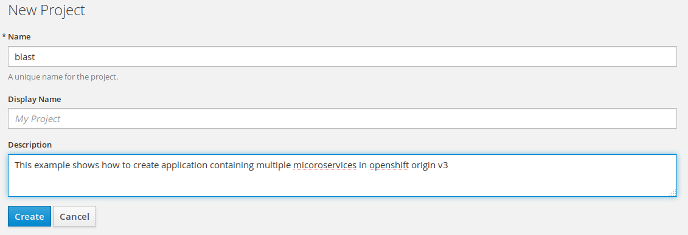
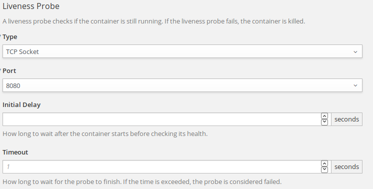
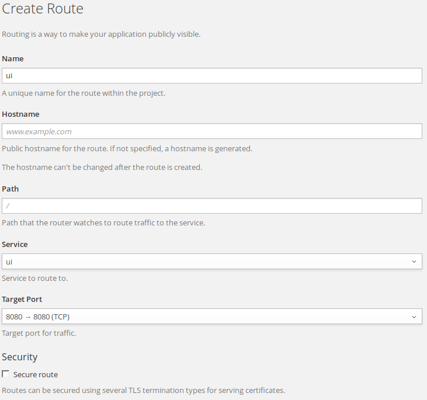
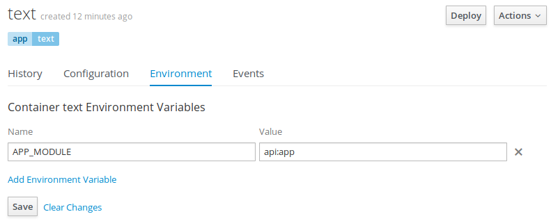
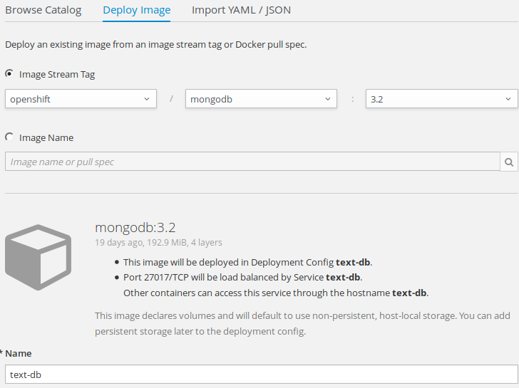
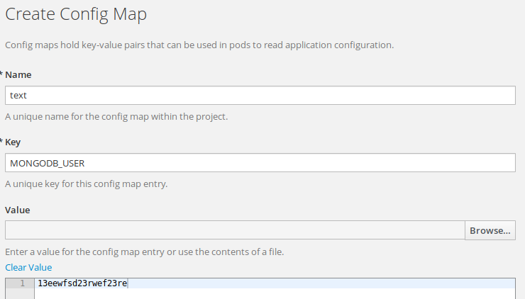

# Effectively running python applications in Kubernetes/OpenShift

## Setup

To follow instructions in the latter part of this scenario it is required you have
access to an OpenShift installation of your choosing.  Here are the possibilities:

- [OpenShift Online](https://www.openshift.com/) - which gives you access to 1GiB
  of storage and memory, which should be sufficient to run this example (verify this!!!!)
- [Minishift](https://github.com/minishift/minishift) - which runs a single-node
  OpenShift cluster in a pre-configured VM.
- [oc cluster up](https://github.com/openshift/origin/blob/master/docs/cluster_up_down.md) -
  which sets up a local all-in-one cluster using docker containers.

**NOTE:** The following steps and resource files assume you're using version 1.5.0 or newer.  If you're using older installment you should check out a [1.4.0 version of the sample application](https://github.com/soltysh/blast/tree/v1.4).

## Introduction to CLI

    oc <verb> <resource>/<name>

where:
- `verb` is one of: `get`, `set`, `describe`, etc.  Run `oc help` to get a full list.
- `resource` is one of resources supported by the platform (or its alias), this includes `DeploymentConfig` (or `dc`), `BuildConfig` (`bc`), `ImageStream` (`is`), `Service` (`svc`), etc.  When bash completions are installed, running `oc get` + `<tab>` will give you a list of available resource names.
- `name` is the resource name given by the user.

Each of the commands can additionally contain flags, see `oc <verb> --help` to get the list of all supported flags.

## Project

We'll start with creating a [project](https://docs.openshift.org/latest/dev_guide/projects.html) where we'll setup the entire application.

    oc new-project blast
        --description="This example shows how to create application containing multiple micoroservices in openshift origin v3"

** Project vs Namespace **

A Kubernetes namespace provides a mechanism to scope resources in a cluster. In OpenShift Origin, a project is a Kubernetes namespace with additional annotations.

TODO

## Frontend - UI

Create our application front-end using following command:

    oc new-app \
        soltysh/lighttpd-centos7~https://github.com/soltysh/blast.git \
        --context-dir=ui \
        --name=ui \
        --labels=app=ui

This will result in OpenShift creating the following resources for us:
- [build configuration](https://docs.openshift.org/latest/dev_guide/builds/index.html)
- [deployment configuration](https://docs.openshift.org/latest/dev_guide/deployments/how_deployments_work.html)
- [image streams](https://docs.openshift.org/latest/dev_guide/managing_images.html)
- [service](https://docs.openshift.org/latest/architecture/core_concepts/pods_and_services.html)

** Explain BuildConfig ** (explain S2I build process in details)

** Explain DeploymentConfig ** (including colorful deployments demos: https://opensource.com/article/17/5/colorful-deployments)
** Explain ReplicationController **
** Explain Pod **

** Explain ImageStreams ** (intro to image streams, including: https://blog.openshift.com/image-streams-faq/)

** Explain Service **

### Probes

After a few minutes, our application should be up and ready, but we want the platform to monitor for its [liveness and readiness](https://docs.openshift.org/latest/dev_guide/application_health.html).  Liveness - verifies the pod is healthy, iow. running, when this fails the scheduler will restart the container.  Readiness on the other hand, goes one step further, and checks whether your application is ready to accept requests, iow. when it can accept traffic.  Actually, the web console will suggest you that you should add those checks:

To set both probes for our newly created application we'll do:

    oc set probe dc/ui --liveness --open-tcp=8080

To verify our the server is up and running.

    oc set probe dc/ui --readiness --get-url=http://:8080/

To verify that the server is returning some content on /.

### Routes

Our final step is to expose the application to the outside world, to do that we'll use the following command:

    oc expose svc/ui

Or using the web console:

By now we should be able to reach our application, you can see the route address with:

    oc get route/ui

Or check the overview page in the web console.

## Text back-end

This time let's try using the web UI to create one of the python back-ends.  Click `Add to project` at the top and pick python 3.5 builder image:

**NOTE:** Don't forget to click `advanced options` and set `Context Dir` to `text`.

Alternatively, you can use the CLI:

    oc new-app \
        https://github.com/soltysh/blast.git \
        --context-dir=text \
        --name=text \
        --image-stream=python:3.5 \
        --labels=app=text
    oc expose svc/text

Once the application builds, we should have the back-end up and running.  Unfortunately, it looks like it's not working as expected, let's debug what's wrong with our application.  Click `#1`:

and dive into deployment details:

to check the pod logs running our application:

Alternatively, you can use the following commands:

    oc get pods -l app=text

Which will return you a list of pods associated with our application.  The `-l app=text` filters the pods to all that have the label `app` set to value `text`.  This happens automatically for every application created using web console, but can be done manually when using `oc new-app` with `--labels` flag.

    oc logs text-1-p07pm

Make sure to use your own pod name here with `oc logs` command to get the logs of from the deployment.

That's right our python runtime has a few requirements.  Let's check the python [S2I builder image](https://github.com/sclorg/s2i-python-container) in details.

** Describe S2I python builder **

To solve our problem we need to set `APP_MODULE=api:app` environment variable:

Alternatively:

    oc set env dc/text APP_MODULE=api:app

Like previously, let's configure the application liveness and readiness probes:

    oc set probe dc/text --liveness --open-tcp=8080
    oc set probe dc/text --readiness --get-url=http://:8080/blast/api/v1.0/text/x

Now that we've added the probes, we see that the application is not being deployed properly.  Let's try to debug what's wrong with it.  Looking into events shows the readiness probe failed:

??? Is there some reasonable CLI ???

The reason readiness failed is that the search back-end wasn't able to connect to database:

## Text database

If we check our [sample application](https://github.com/soltysh/blast/tree/master/text) we clearly see it's reaching to MongoDB, which we haven't deployed, yet:

    oc new-app mongodb:3.2 \
        --name=text-db \
        --labels=app=text

This time again our mongodb deployment isn't working properly.  Looking once again into its logs:

OpenShift provided images have a set of required environment variables to be working properly.  They are all documented in https://docs.openshift.org/latest/using_images/db_images/index.html.  Looking at [MongoDB usage documentation](https://docs.openshift.org/latest/using_images/db_images/mongodb.html#configuration-and-usage) and knowing what we got in the logs we clearly see we need to set three values:

- `MONGODB_USER` - user name for the MongoDB account.
- `MONGODB_PASSWORD` - password for the user account.
- `MONGODB_DATABASE` - database name.

But since those data will be needed in several places of our application we would like to have a single place for that configuration.  This is where a [ConfigMap](https://docs.openshift.org/latest/dev_guide/configmaps.html) is being introduced.

## ConfigMap

On the Deployment Config configuration page, see Volumes section, there's a link allowing you to Add Config Files:

On the next screen we'll pick Create ConfigMap and fill it in with required data:

**NOTE:** Both user name and password can be random strings, but database name needs to be `blast_text`.

ConfigMap can be consumed in few possible ways:

- as environment variables
- as files

Once that is done we'll use a nice shorthand command to point both of our text deployments to the newly created config map:

    oc set env dc/text-db --from=configmap/text
    oc set env dc/text --from=configmap/text

## Templates

    oc new-app https://raw.githubusercontent.com/soltysh/blast/master/video/template.yaml
    oc new-app https://raw.githubusercontent.com/soltysh/blast/master/image/template.yaml

## CronJob

    oc run scraper --schedule="0/1 * * * *" --image=soltysh/scraper --restart=Never

## ServiceAccounts

    oc policy add-role-to-user view -z default

## Resource Limits

## Persistent Volumes

https://learn.openshift.com/
http://docs.openshift.org/
