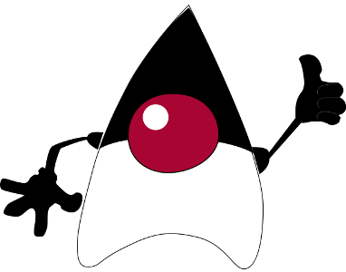

name: title
layout: true
class: center, middle, inverse
---
# How a Java dev benefited
# from transitioning to Go
.footnote[Maciej Szulik, DevConf 2016]


---
.pull-left[]
.pull-right[]
# vs


---
layout: false
.left-column[
## Agenda
]
.right-column[
1. Benefits from transition

1. Java and Go comparison:

   * General syntax

   * Types & data structures

   * Interfaces and OOP

   * Concurrency

   * Error handling

   * Reflection

   * Web development

   * garbage collection & memory management

1. Summary
]


---
.left-column[
## @soltysh
]
.right-column[
## .awesome[.fa-twitter[] .fa-github[] .fa-google[] .fa-bitbucket[]]

### +10 years of experience
### C/C++ , Java , Go, Python
### dev -> team lead
### OpenShift
]


---
.left-column[
## Opinions
]
.right-column[
```
> don't switch
> I miss debugging
> and knowing my interfaces
> and generics
> and collections
> and good logging frameworks
> I miss machine-driven refactors that just
  worked
```
]

--
.right-column[
```
> i do think gofmt was a brilliant move
> having to never think about those issues
  has been awesome
> there's plenty i miss about the JVM
```
]

--
.right-column[
```
> i miss it
> there's plenty i miss about the JVM
* engineer secretly loves java
```
]


---
.left-column[
## Comparison
### - pros
]
.right-column[
* syntax
* types & data structures
* interfaces and OOP
* concurrency
* error handling
* reflection
* web development
* garbage collection & memory management
]


---
.left-column[
## Comparison
### - pros
### - neutral
]
.right-column[
* syntax
* types & data structures
* interfaces and OOP
* concurrency
* error handling
* reflection
* web development
* garbage collection & memory management
<br /><br /><br />
* code organization
* error handling
]


---
.left-column[
## Comparison
### - pros
### - neutral
### - cons
]
.right-column[
* syntax
* types & data structures
* interfaces and OOP
* concurrency
* error handling
* reflection
* web development
* garbage collection & memory management
<br /><br /><br />
* code organization
* error handling
<br /><br /><br />
* debugger
]


---
.left-column[
## Comparison
]
.right-column[
```java
public class HelloWorld {
    public static void main(String[] args) {
        System.out.println("Hello, World");
    }
}
```
```bash
$ javac main.java
$ java Main
```
]


--
.right-column[
```go
package main

import "fmt"

func main() {
    fmt.Println("Hello world!")
}
```
```bash
$ go run main.go
```
]


---
.left-column[
## Comparison
### - types
]
.right-column[
```go
var age int = 35
```

```go
var age int
age = 35
```

```go
age := 35
_ = age
```
]

???
Go provides usually expected types, such as: boolean, numeric, string, array and
maps. As a complementary to arrays there are also slices. A slice is a descriptor
for a contiguous segment of an underlying array and provides access to a numbered
sequence of elements from that array. Additionally go provides struct types allowing
to define a sequence of fields, function types and an interface.

Although language is statically types is does not require, like other statically
types languages, to always define the type of a variable. The type can be
determined at runtime upon assignment.

Implicit conversion between types, even those predefined is not possible, iow.
there's no possibility to implicitly convert int16 to int32.

Unused variables are compilation error, the same applies to unused imports.

There's one caveat with short variable declaration syntax, it's so handy that it's
sometimes overused, leading to shadowing variables.


---
.left-column[
## Comparison
### - types
### - syntax
]
.right-column[
```go
if x > 0 {
    return y
}
```
```go
if err := check(file); err != nil {
    return err
}
```
]


---
.left-column[
## Comparison
### - types
### - syntax
]
.right-column[
```go
sum := 0
for i := 0; i < 10; i++ {
    sum += i
}
```
```go
for key, value := range myMap {
    fmt.Printf("%s: %s\n", key, value)
}
```
]


---
.left-column[
## Comparison
### - types
### - syntax
]
.right-column[

]
